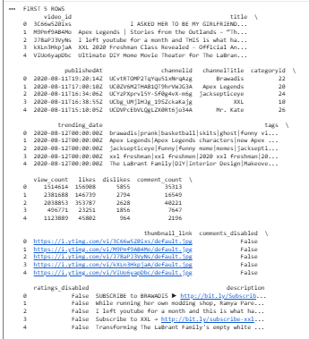
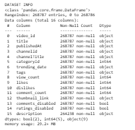
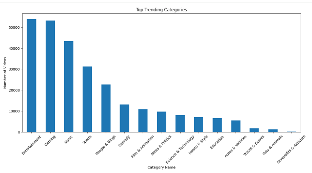
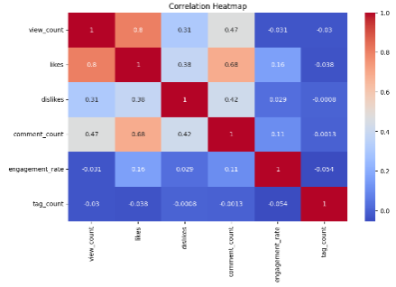

# 📺 YouTube Video Analysis


---

# 📌 Project Overview

This project analyzes YouTube video data using Python to identify trends, audience engagement, and factors affecting video performance. It includes data cleaning, exploratory data analysis (EDA), visualization, and machine learning.

---

# 🎯 Objectives

- Analyze YouTube video data
- Clean and preprocess the dataset
- Perform Exploratory Data Analysis (EDA)
- Create visualizations
- Train a Machine Learning model
- Evaluate model performance

---

# 🛠 Technologies Used

- Python
- Pandas
- NumPy
- Matplotlib
- Scikit-learn
- Google Colab

---

# 📂 Project Structure

```text
youtube-video-analysis/
│
├── youtube_video_analysis.ipynb
├── Project_Report.pdf
├── README.md
├── requirements.txt
├── LICENSE
└── images/
```

---

# 📷 Project Screenshots

## Dataset Preview



---

## Dataset Information



---

## Data Visualization



---

## Correlation Heatmap



---

## Model Prediction


---

# 📈 Results

- Successfully cleaned the dataset
- Performed exploratory data analysis
- Created meaningful visualizations
- Trained a machine learning model
- Generated predictions successfully

---

# 🚀 Future Improvements

- Improve model accuracy
- Deploy using Streamlit
- Build an interactive dashboard

---

# 👩‍💻 Author

**Bushra Naseem**

Data Science Student

Python | Machine Learning | Data Analysis

⭐ If you found this project useful, consider giving it a star.
